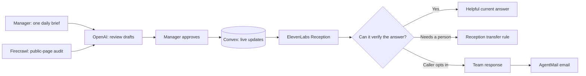

# Holiday Helper

**A live phone helper for the operational details that change today.**

Holiday Helper gives a busy local team one short place to say what is different now: a special, closure, event, service change, promotion, or exception. The team reviews the small set of caller answers it produces and chooses what goes live. During a call, ElevenLabs Reception retrieves only the currently effective, manager-approved updates from Convex. When a caller needs more, Reception can use its human-transfer rule or—with consent—create a concise request for the team to answer by email.

The first demonstration uses a clearly labeled Desert Community Foundation line. It is not an official Foundation information, donor-support, or emergency service.

## The product loop



1. **One manager desk.** The team speaks or types a short daily brief, reviews it, and approves it. Reception's greeting, voice, number, and transfer target are one-time setup, not a second update workflow.
2. **Time-aware information.** Each update is marked _today only_, _temporary_, or _ongoing_. Today and temporary updates leave the line automatically at the chosen local end date.
3. **Human approval before voice use.** Website or AI suggestions are drafts. Nothing reaches callers until a manager puts it on the line.
4. **A real person when it matters.** The agent answers what it can verify, then follows the configured Reception transfer rule or creates a consented email request for a person to finish.
5. **Minimal retention.** Requests and optional photos are scheduled for deletion after seven days.

## Product architecture

| Technology               | Role                                                                                                                                                                                    |
| ------------------------ | --------------------------------------------------------------------------------------------------------------------------------------------------------------------------------------- |
| **Convex**               | Stores durable briefs and updates, serves real-time phone knowledge, scopes each location’s connection, powers the manager queue, applies access checks, and schedules request cleanup. |
| **OpenAI**               | Turns a manager’s unstructured operating brief into a few concise drafts for approval.                                                                                                  |
| **Firecrawl**            | Audits a public page for dated, current operations details. It creates review suggestions and never publishes automatically.                                                            |
| **ElevenLabs Reception** | Runs the conversation, retrieves live verified updates, and handles a configured human transfer.                                                                                        |
| **AgentMail**            | Sends a manager-reviewed reply after a caller explicitly consents to email.                                                                                                             |

## Location routing

Each business or location has its own phone connection. New connections use a unique, authenticated route such as:

```text
/hotline/v1/<location-route-key>/knowledge
/hotline/v1/<location-route-key>/requests
```

The route key selects the location; the provider supplies a separate one-time secret header. Convex stores only a hash of that secret. This replaces the original single-pilot routing pattern while retaining the original DCF route during its controlled migration.

A dedicated number for each location, or forwarding from an existing number, is the right first pilot model. A shared district concierge can become a separate product once the per-location workflow is proven.

## Pilot readiness

Verified in the project:

- A manager’s brief can become persistent review drafts and individually approved live updates.
- Existing approved facts automatically migrate into the new durable update history when a manager opens the desk.
- ElevenLabs Reception text chat previously retrieved an approved DCF closure through the authenticated Convex tool.
- A human-transfer rule is saved in Reception.
- A manager-reviewed AgentMail reply was accepted by the provider with a message ID.
- TypeScript, ESLint, and the Sites production build pass.

Still requiring a live, authorized pilot check:

- An inbound audio call through the dedicated number.
- A completed transfer to an approved destination.
- A consented request created by Reception and a confirmed inbox delivery.
- Moving the existing DCF Reception tool from its legacy single-pilot route to the new location-scoped route.

## Local development

```bash
npm run dev
npm run typecheck
npm run lint
npm run build
```

`npm run test:local` exercises the isolated local Convex backend, including cross-location access checks, update approval, connection provisioning, request idempotency, photo ownership, and protected webhooks. Provider keys remain Convex environment variables and are never checked into source.
