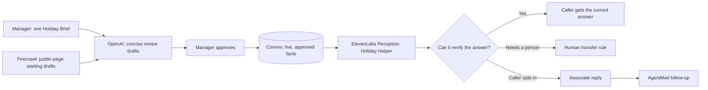

# Holiday Helper

**A manager-approved holiday hotline for local businesses and community organizations.**

Holiday Helper gives a busy local team one place to keep its public, time-sensitive information current. A manager types or dictates a short Holiday Brief, reviews the few updates it produces, and approves them. The phone agent then answers only from those approved, unexpired updates. When it cannot verify an answer, it can hand the caller to a person or—with the caller’s permission—create a concise follow-up request for an associate.

The first demonstration uses a clearly labeled Desert Community Foundation demo line. It is not an official Foundation service.

## Why it matters

During the holidays, a local store or community organization gets questions that are easy to answer but expensive in interruption time: *Are you open? Is gift wrapping available? Did the event move? Can someone check a size?* Information across websites, listings, phone messages, and search results is often old.

Holiday Helper treats the manager’s latest approved update as the source of truth for the season. It is deliberately not a forum, a CRM, a payment workflow, or a connector to a retailer’s POS.

## How it works



1. **One manager card.** The Holiday Brief accepts plain language or browser dictation. It creates a small, reviewable set of updates instead of a large FAQ to maintain.
2. **Human approval before voice use.** Nothing drafted from a website or an AI model appears on the line until the manager explicitly approves it.
3. **Live answers.** The Reception agent retrieves only manager-approved, unexpired information from an authenticated Convex HTTP endpoint at answer time.
4. **A person when it matters.** The agent handles verified routine questions, hands off questions it cannot verify under a Reception transfer rule, and can request a manager-reviewed email follow-up only after a caller consents.
5. **Limited retention.** Pilot follow-up requests and any attached item photos are scheduled for deletion after seven days.

## Sponsor technologies

| Technology | Role in Holiday Helper |
| --- | --- |
| **Convex** | Source of truth for facts and requests, live desk updates, authenticated HTTP tool, access checks, scheduled retention cleanup, and the AgentMail delivery workflow. |
| **OpenAI** | Turns a manager’s unstructured seasonal note into a small set of concise review drafts. |
| **Firecrawl** | Checks a public website for dated, holiday-specific operations details and proposes starting drafts for review. It does not automatically publish web content. |
| **AgentMail** | Sends a manager-reviewed email follow-up from the Holiday Hotline inbox after a caller has explicitly opted in. |
| **ElevenLabs Reception** | Runs the dedicated phone experience and calls the Convex knowledge tool during a conversation. |

## What has been verified

- A manager entered and approved five seasonal closure facts through the one-card flow.
- In ElevenLabs Reception text chat, the live agent called the authenticated Convex endpoint and correctly answered that the DCF demo office is closed on Thanksgiving Day.
- A human-transfer rule is configured in Reception for questions a person needs to handle.
- AgentMail is connected to the Convex reply workflow. A manager-reviewed reply to an explicitly approved test recipient completed with a provider message ID and no delivery error.
- TypeScript, ESLint, the Sites production build, and the Convex development deployment have passed.

The dedicated phone number, a live audio conversation, and a completed call transfer remain the final demonstration checks. The app is intentionally not positioned as an official information channel until a pilot organization approves its information and operating policy.

## Local development

```bash
npm run dev
npm run typecheck
npm run lint
npm run build
```

This project uses a private Convex development deployment during development. Provider credentials are environment variables and are never stored in source control. See [hackathon.md](hackathon.md) for the evidence-backed build log and [SUBMISSION.md](SUBMISSION.md) for the hackathon entry and demo package.
